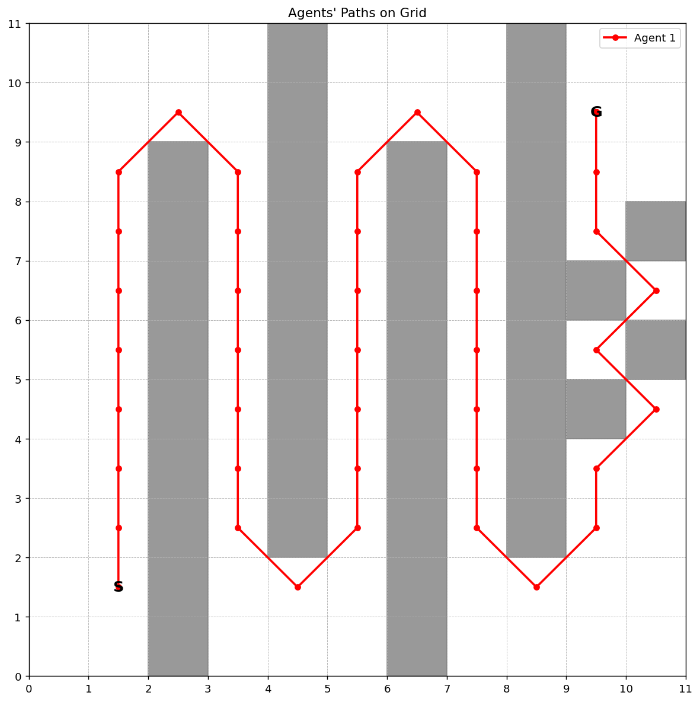
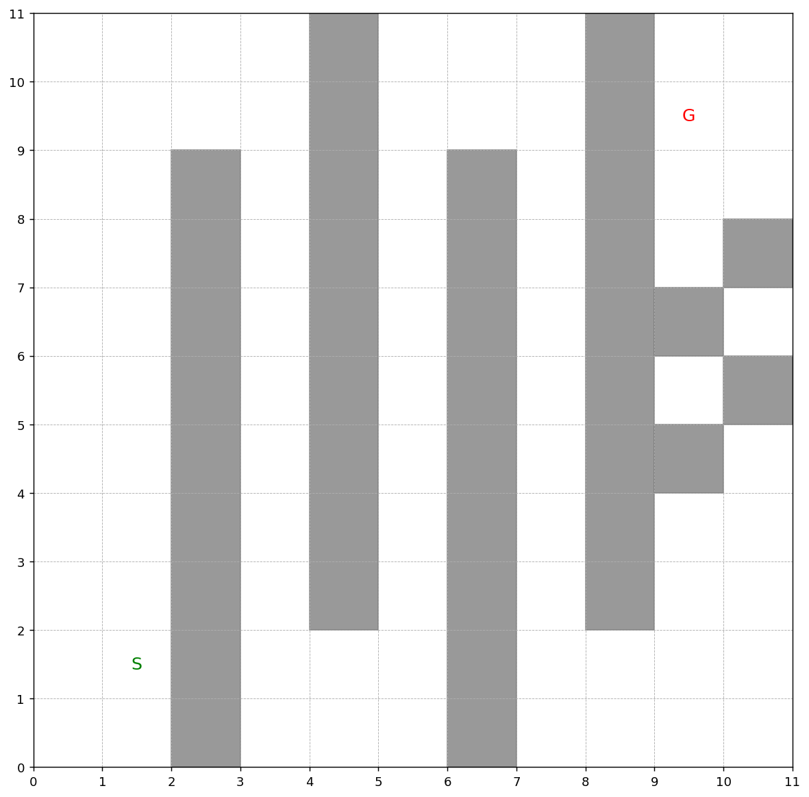
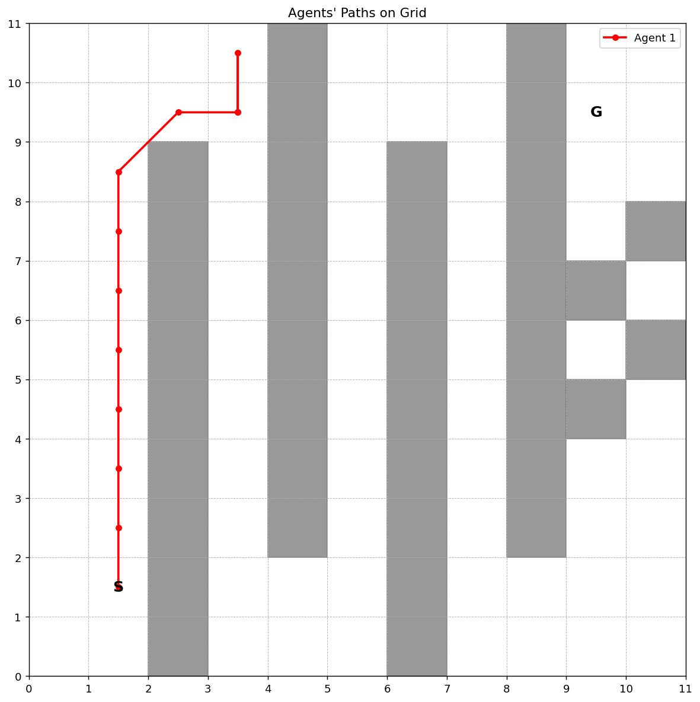
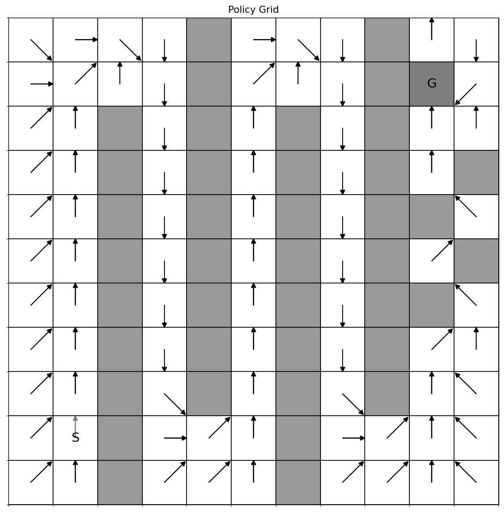
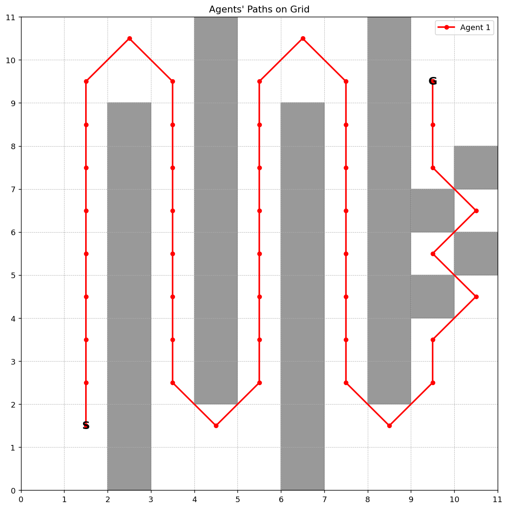
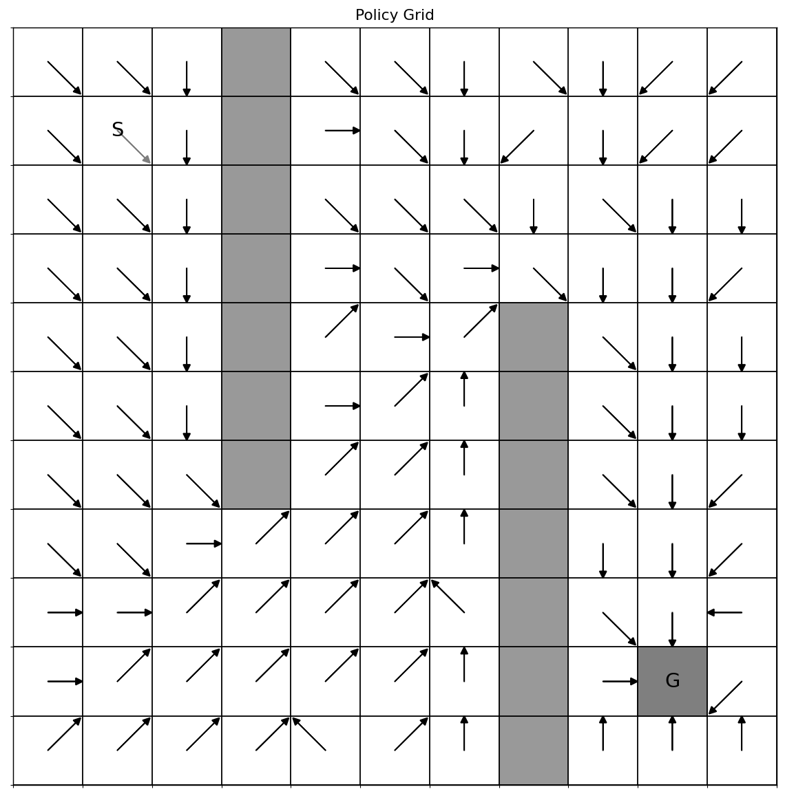
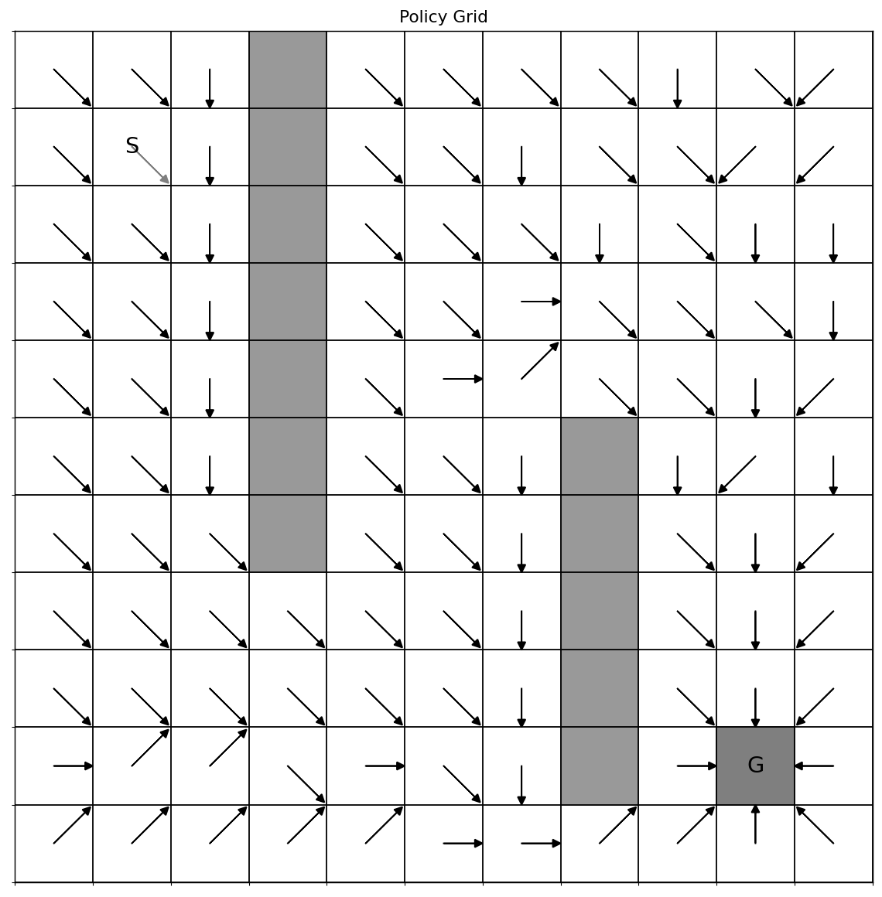

<div align="center">

# Multi-Robot RL Path Planning

### Comparing Value Iteration, Q-Learning, Dyna-Q, and Dyna-Q+ on Grid-World Navigation




*A robot trained with Q-Learning navigating from start (S) to goal (G) around a field of static obstacles.*

</div>

---

## Overview

This project implements and compares four reinforcement learning algorithms for **robot path planning** in a grid world with static and dynamic obstacles:

- **Value Iteration** — model-based, dynamic-programming control
- **Q-Learning** — model-free, off-policy temporal-difference control
- **Dyna-Q** — model-free learning combined with model-based planning
- **Dyna-Q+** — Dyna-Q with an exploration bonus for adapting to a *changing* environment

Each agent moves on a discrete 8-directional grid, must avoid rectangular obstacles, and receives a reward signal that combines a per-step cost, a distance-to-goal shaping term, and a large terminal reward for reaching the goal. The repository includes reusable visualization tools for the learned **policy grid** (optimal action per cell) and the **resulting robot path**.

---

## Table of Contents

- [Key Features](#key-features)
- [Environment & Reward Design](#environment--reward-design)
- [Algorithms & Results](#algorithms--results)
  - [Value Iteration](#1-value-iteration)
  - [Q-Learning](#2-q-learning)
  - [Dyna-Q](#3-dyna-q)
  - [Dyna-Q+ (Dynamic Environment)](#4-dyna-q-dynamic-environment)
- [Repository Structure](#repository-structure)
- [Getting Started](#getting-started)
- [Configuration](#configuration)
- [Future Work](#future-work)
- [Author](#author)

---

## Key Features

- **Four RL algorithms** implemented from scratch with NumPy — no RL framework dependency
- **Multi-robot support**, with a battery-aware priority rule that resolves cell collisions between agents
- **Customizable grid world** — grid size, movement step, and rectangular obstacle layout are all configurable
- **8-directional action space** (N, NE, E, SE, S, SW, W, NW) rather than the usual 4-directional grid
- **Policy grid & path visualization**, plus an animated multi-robot playback
- **Dynamic environment handling** — Dyna-Q+ re-plans after an obstacle changes mid-training

---

## Environment & Reward Design

<div align="center">


*The 10×10 grid world: gray cells are obstacles, `S` is the robot's start cell, `G` is the goal.*
</div>

**Action space** — each robot chooses one of 8 moves per step (the diagonals move `step` in both axes at once):

| 0 | 1 | 2 | 3 | 4 | 5 | 6 | 7 |
|---|---|---|---|---|---|---|---|
| ↑ | ↗ | → | ↘ | ↓ | ↙ | ← | ↖ |

**Reward function** (`compute_reward`):

```
reward = -1                              # per-step cost
reward -= 0.1 * distance_to_goal         # shaping term, pulls the agent toward the goal
reward += 1000   if goal reached
reward -= 1000   if the resulting state is invalid (obstacle / out-of-bounds)
```

**Multi-robot coordination** — when two robots would occupy the same cell on the same step, the robot with the lower battery level gets priority to move while the other waits, giving a simple, deterministic collision-avoidance rule.

---

## Algorithms & Results

### 1. Value Iteration

Model-based dynamic programming: the environment's transition and reward model is known, so the optimal value function is computed directly by iterating the Bellman optimality equation to convergence, then the policy is read off as the arg-max action per cell.

<table>
<tr>
<td align="center"><br><sub>Converged optimal policy — arrows show the best action per cell</sub></td>
<td align="center"><br><sub>Robot path replayed from the policy (fixed step budget)</sub></td>
</tr>
</table>

### 2. Q-Learning

Model-free, off-policy TD control (7000 episodes, ε-greedy exploration): the agent learns action-values `Q(s,a)` purely from sampled transitions, with no access to the reward/transition model.

<table>
<tr>
<td align="center"><br><sub>Learned policy after 7000 training episodes</sub></td>
<td align="center"><br><sub>Resulting path: the robot successfully reaches the goal</sub></td>
</tr>
</table>

### 3. Dyna-Q

Combines direct Q-learning updates from real experience with additional **planning** updates sampled from a learned model of the environment (200 episodes, 50 planning steps per real step), converging in far fewer real episodes than plain Q-Learning.

<table>
<tr>
<td align="center"><br><sub>Learned policy after 200 episodes + planning</sub></td>
<td align="center"><br><sub>Resulting path: the robot successfully reaches the goal</sub></td>
</tr>
</table>

### 4. Dyna-Q+ (Dynamic Environment)

Dyna-Q+ adds an exploration bonus for state-actions that haven't been tried recently, so the agent keeps probing for a better path even after it thinks it has converged. This repo's training loop exploits that: **partway through training, an obstacle is added to the grid**, and the policy is re-plotted both *before* and *after* the environment changes.

<table>
<tr>
<td align="center"><br><sub>Policy at episode 100 — <b>before</b> the obstacle change</sub></td>
<td align="center"><br><sub>Policy at episode 1000 — <b>after</b> adapting to the new obstacle</sub></td>
</tr>
</table>

---

## Repository Structure

```
Reinforcement-learning-for-robot-path-planning/
├── value iteration.py    # Value Iteration algorithm
├── Q_learning.py         # Q-Learning algorithm
├── dyna_q.py              # Dyna-Q algorithm
├── dyna_qplus.py          # Dyna-Q+ algorithm (dynamic environment)
├── assets/                # Policy/path visualizations used in this README
└── README.md
```

---

## Getting Started

### Prerequisites

- Python 3.7+
- NumPy, Matplotlib

```bash
pip install numpy matplotlib
```

### Usage

Run any algorithm directly to train an agent and visualize the result:

```bash
python "value iteration.py"
python Q_learning.py
python dyna_q.py
python dyna_qplus.py
```

Each script will:
1. Build the grid world and obstacle layout
2. Train the RL agent(s)
3. Plot the learned policy grid
4. Animate and plot the resulting robot path(s)

---

## Configuration

**Environment** (top of each script):

```python
width = 10       # grid width
height = 10      # grid height
step = 1         # movement step size
list = []        # obstacles, as [center_x, center_y, width, height, ...]
```

**Robots**:

```python
robot1 = robot(x_start, y_start, x_end, y_end)
agents = [robot1, robot2, ...]   # supports multiple agents
```

**Learning hyperparameters** used in each script's default run:

| Algorithm | Episodes | γ (gamma) | ε (epsilon) | α (alpha) | Planning steps |
|---|---|---|---|---|---|
| Value Iteration | until convergence | 0.9 | – | – | – |
| Q-Learning | 7000 | 0.9 | 0.7 | 0.1 | – |
| Dyna-Q | 200 | 0.9 | 0.2 | 0.1 | 50 |
| Dyna-Q+ | 1000 | 0.9 | 0.7 | 0.1 | 50 |

---

## Future Work

- Extend multi-robot coordination beyond the single-agent examples currently configured
- Replace the fixed replay step-budget with a run-until-goal-or-timeout playback
- Add deep RL baselines (DQN) for larger, continuous-like grids
- Quantitative comparison of convergence speed and path optimality across algorithms

---

## Author

**Haidar Saad**
